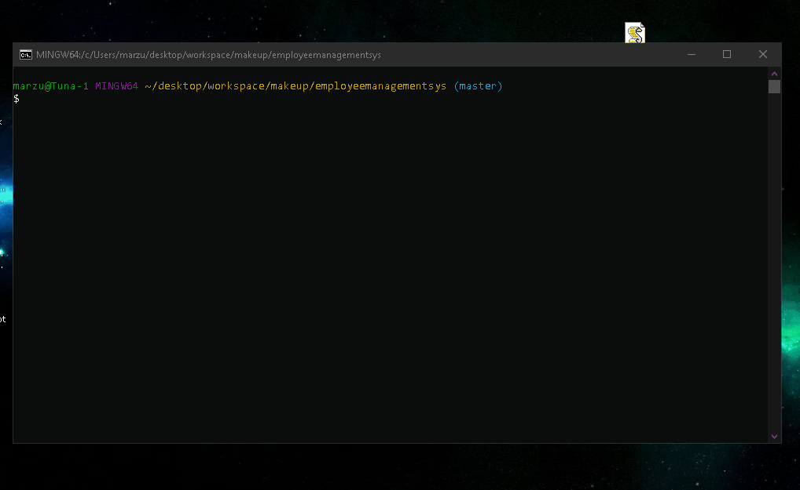

# Employee-Tracker 





## Table of Contents

*   Description
*   Deployment
*   Contact

## Description

To create an Employee Database on a backend server using Node.js. User can view current employees, roles, and departments as well as their relative salaries.
They can also add/remove employees, roles, and departments using this plateform.

## Deployment

### Clone Repository 

```bash
git clone git@github.com:Amarz94/FitnessTracker.git

```

### Required Programs

- Node.JS
- MySQL
- NPM

### Required Dependencies

- inquirer
- mysql
- console.table

### Launching program

```bash
npm i inquirer mysql console.table
node server.js

```

## Developer

Any questions or comments, please feel free to contact me via my email or github:

[marzullo94@gmail.com](mailto:marzullo94@gmail.com)
[My Github](https://github.com/Amarz94)


## Tests
